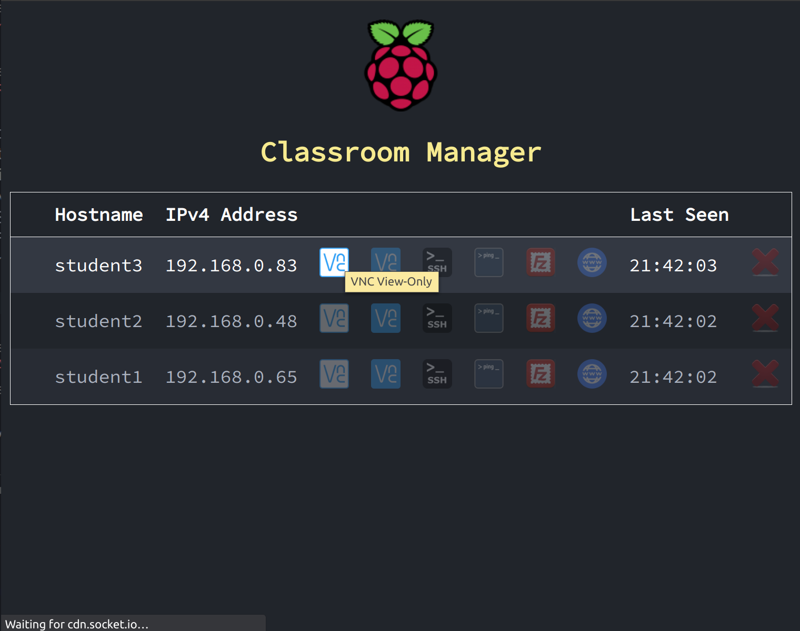
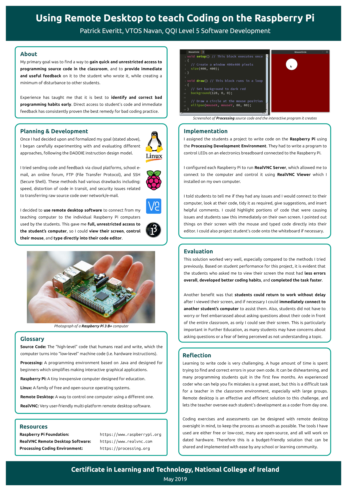

# Creative Coding Classroom

## Raspberry Pi Classroom Management System for Creative Coding Classes

"Web App" interface for managing a classroom of Raspberry Pi computers. Simplifies and greatly speeds up the process of running the most common remote management tasks in the classroom - or at least the tasks I found myself running 10 to 20 times per class! It basically acts a launcher for applications and makes it much easier to interact directly with coding students in their IDE. Currently supports:
* Ping
* VNC Remote Desktop (Full Access and View-Only)
* SSH Remote Shell
* SFTP File Transfer 
* Browse public HTML folder

## Screenshots
### VNC Remote Desktop

### SSH Secure Shell

### Ping

### SFTP Client

### Browse public HTML folder of host

## Architecture
### Client
* Python (previously Bash) script set to run every minute as a cronjob
	* Creates JSON file with info about Raspberry Pi client (e.g. hostname, user, MAC address)
	* Passes JSON data to PHP script on server

### Server
* Web server PHP script listens for JSON data from Raspberry Pi clients
	* Received data saved to local file named according to the MAC address of sender

* admin.php:
	* Admin Page with dynamic table of up-to-date details about Raspberry Pi clients
	* Contains details (e.g. hostname, user, IP address, last time seen) and clickable icons for common tasks (i.e. ping, ssh, vnc, sftp)

* Node.js server:
	* Uses WebSocket to listen for socket connections from "admin page" in browser
	* Executes commands on server (e.g. ping, ssh, etc.) in response to data received through socket
	* Some tasks (e.g. ping, ssh) launch a new terminal window and run in that window
	* Some tasks (e.g. VNC, Filezilla SFTP) launch their own application window
	* SSH configured for RSA key login
	* RealVNC config file dynamically generated to allow login using stored password

## Additional Material
### Creative Coding Video Lesson for Absolute Beginners

### Poster Presentation on Teaching Coding using Remote Desktop Technology

